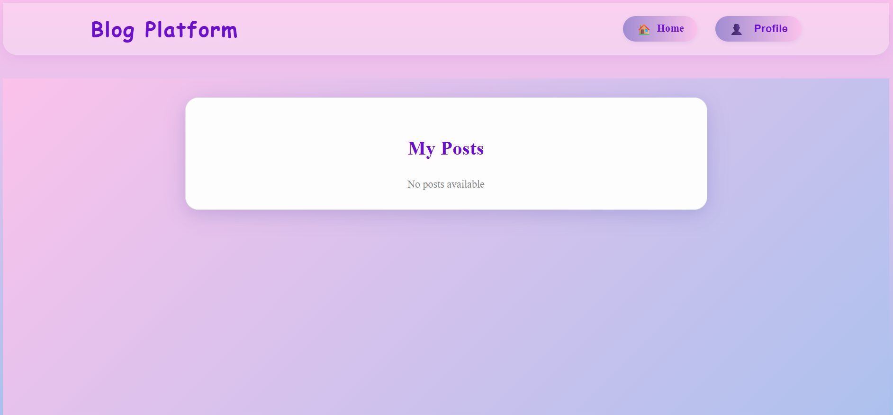

# Blog Publishing Platform

This project is a blog publishing platform built with a React frontend, a Node.js (Express) backend, and MongoDB as the database. It includes features for user authentication, blog post CRUD operations, and author profiles.

## Features

- **User Authentication**: Users can register and log in to their accounts using JWT for secure authentication.
- **Blog Post Management**: Users can create, read, update, and delete blog posts.
- **Author Profiles**: Each user has a profile that displays their information and a list of their blog posts.

## Project Structure

```
blog-platform
├── backend
│   ├── src
│   │   ├── app.js
│   │   ├── controllers
│   │   │   ├── authController.js
│   │   │   ├── postController.js
│   │   │   └── profileController.js
│   │   ├── models
│   │   │   ├── User.js
│   │   │   ├── Post.js
│   │   │   └── Profile.js
│   │   ├── routes
│   │   │   ├── authRoutes.js
│   │   │   ├── postRoutes.js
│   │   │   └── profileRoutes.js
│   │   └── middleware
│   │       └── authMiddleware.js
│   ├── package.json
│   └── README.md
├── frontend
│   ├── src
│   │   ├── App.jsx
│   │   ├── components
│   │   │   ├── Auth
│   │   │   │   ├── Login.jsx
│   │   │   │   └── Register.jsx
│   │   │   ├── Blog
│   │   │   │   ├── BlogList.jsx
│   │   │   │   ├── BlogForm.jsx
│   │   │   │   └── BlogDetail.jsx
│   │   │   └── Profile
│   │   │       └── ProfileView.jsx
│   │   ├── pages
│   │   │   ├── Home.jsx
│   │   │   ├── Blog.jsx
│   │   │   └── Profile.jsx
│   │   └── utils
│   │       └── api.js
│   ├── package.json
│   └── README.md
└── README.md
```

## Getting Started

### Prerequisites

- Node.js
- MongoDB

### Installation

1. Clone the repository:
   ```
   git clone <repository-url>
   cd blog-platform
   ```

2. Install backend dependencies:
   ```
   cd backend
   npm install
   ```

3. Install frontend dependencies:
   ```
   cd frontend
   npm install
   ```

### Running the Application

1. Start the backend server:
   ```
   cd backend
   npm start
   ```

2. Start the frontend application:
   ```
   cd frontend
   npm start
   ```

####output screen shots

register


home-1


home-2


create-post


created-post in home


post in readmore view


dropdown profile


myposts


editpost


deletepost


no posts available


MyProfile


### API Documentation

Refer to the backend README for detailed API endpoints and usage.

## Contributing

Contributions are welcome! Please open an issue or submit a pull request for any improvements or features.

## License

This project is licensed under the MIT License.
